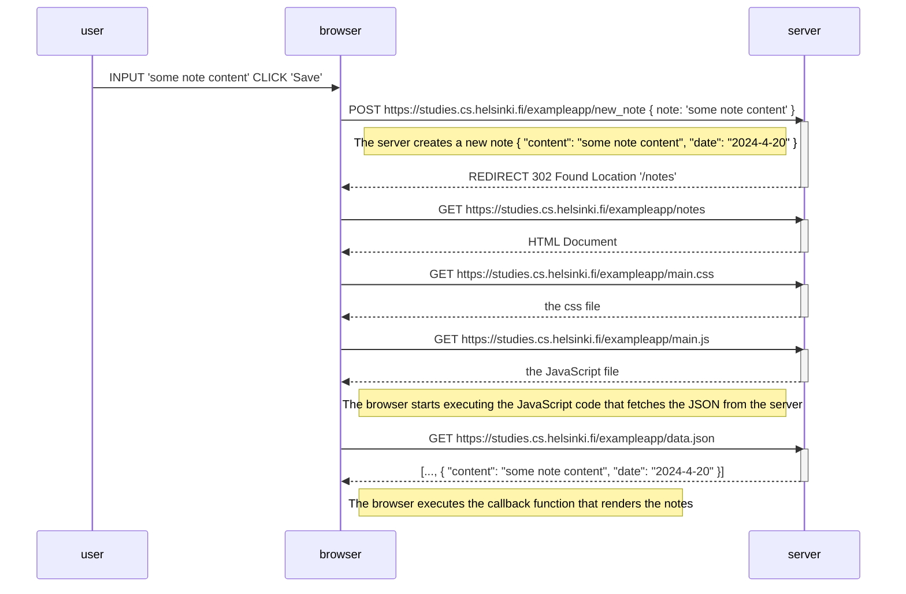

```mermaid
sequenceDiagram
    participant user
    participant browser
    participant server

    user->>browser: INPUT 'some note content' CLICK 'Save'
    browser->>server: POST https://studies.cs.helsinki.fi/exampleapp/new_note { note: 'some note content' }
    activate server
    Note left of server: The server creates a new note { "content": "some note content", "date": "2024-4-20" }
    server-->>browser: REDIRECT 302 Found Location '/notes'
    deactivate server

    browser->>server: GET https://studies.cs.helsinki.fi/exampleapp/notes
    activate server
    server-->>browser: HTML Document
    deactivate server

    browser->>server: GET https://studies.cs.helsinki.fi/exampleapp/main.css
    activate server
    server-->>browser: the css file
    deactivate server

    browser->>server: GET https://studies.cs.helsinki.fi/exampleapp/main.js
    activate server
    server-->>browser: the JavaScript file
    deactivate server

    Note right of browser: The browser starts executing the JavaScript code that fetches the JSON from the server

    browser->>server: GET https://studies.cs.helsinki.fi/exampleapp/data.json
    activate server
    server-->>browser: [..., { "content": "some note content", "date": "2024-4-20" }]
    deactivate server

    Note right of browser: The browser executes the callback function that renders the notes
```
