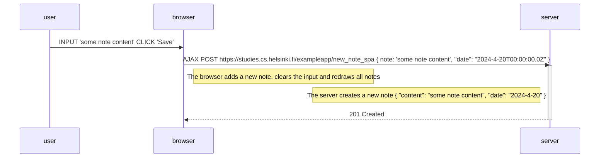

```mermaid
sequenceDiagram
    participant user
    participant browser
    participant server

    user->>browser: INPUT 'some note content' CLICK 'Save'
    browser->>server: AJAX POST https://studies.cs.helsinki.fi/exampleapp/new_note_spa { note: 'some note content', "date": "2024-4-20T00:00:00.0Z"  }
    activate server
    Note right of browser: The browser adds a new note, clears the input and redraws all notes
    Note left of server: The server creates a new note { "content": "some note content", "date": "2024-4-20" }
    server-->>browser: 201 Created
    deactivate server
```
